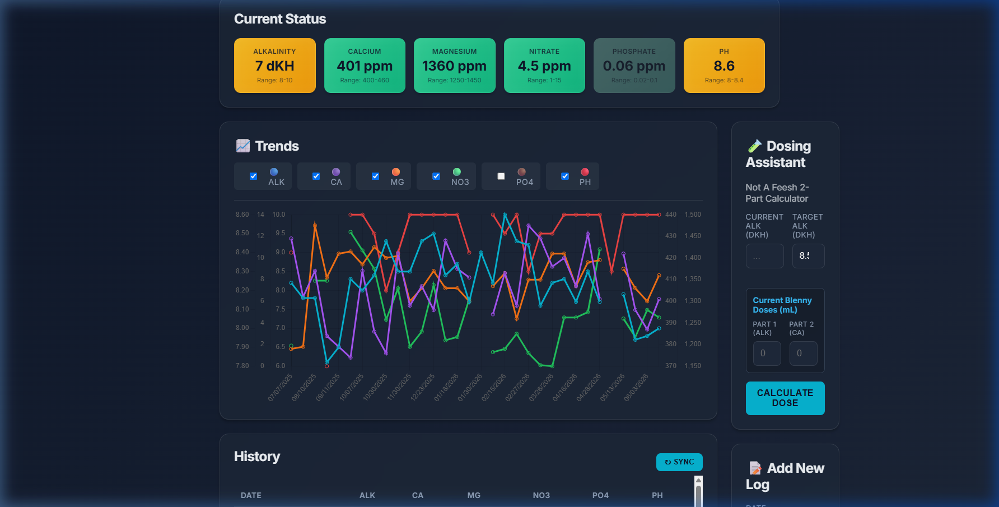
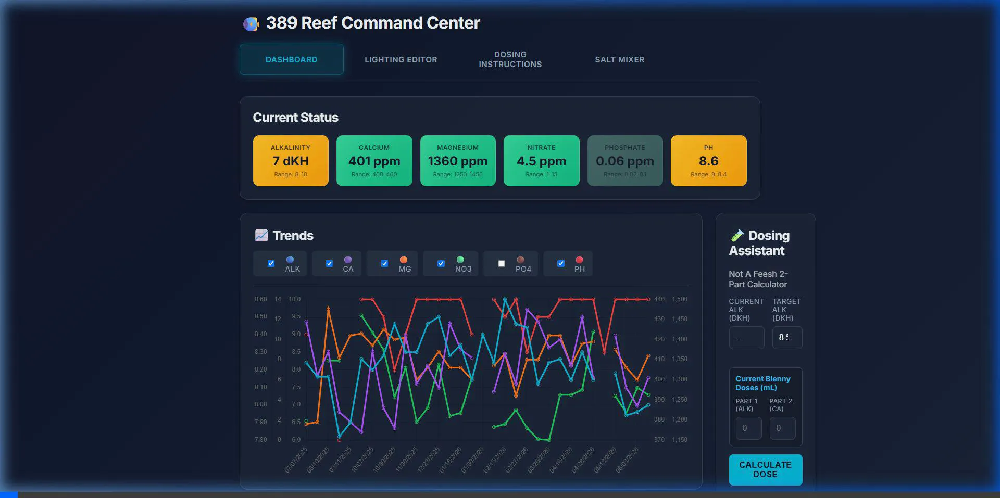

# Reef Dashboard Redesign Walkthrough

We have successfully redesigned the **Dashboard** page of the Reef Command Center to feel like a high-density, professional command console.

---

## 🎨 Key Features Implemented

1. **Widescreen Desktop Layout**:
   * Expanded the body layout constraints (`max-width: 1500px`) to prevent visual squishing and maximize unused screen space.
   * Increased the **Trends** chart height on desktop screens to `500px` for optimal data visualization.
   * On wide displays, elements form a two-column sidebar layout:
     * **Left (Main) Panel**: The large **Trends** Chart and **History** Table.
     * **Right (Sidebar) Panel**: The **Add New Log** form and **Dosing Assistant** calculator.
   * Responsive media queries ensure it folds down nicely on mobile screens.

2. **Expanded KPI Parameter Cards**:
   * Upgraded from 3 parameter cards to a dynamic suite of **6 KPI Cards** (Alkalinity, Calcium, Magnesium, Nitrate, Phosphate, pH) showing current readings, target ranges, and status colors.

3. **Interactive Toggling & Highlights**:
   * Clicking any KPI card dynamically shows/hides the corresponding line in the Trends Chart.
   * Deselected parameter cards are dimmed/greyed out.

4. **Multi-Tank Support (WB35 & IM24)**:
   * Segmented pill switcher in the header to toggle between **33G Waterbox** and **24G Reef**.
   * Dynamically loads data from `WB35` or `IM24` sheet tabs in Google Sheets.
   * Adapts the **Dosing Assistant** to the active tank volume (33 gal vs 24 gal).
   * Automatically attaches active sheet tag to **Add New Log** submissions.

5. **Installable Progressive Web App (PWA)**:
   * Custom app icons generated from your artwork (`192x192`, `512x512`, `apple-touch-icon`).
   * Web App Manifest (`manifest.json`) for full-screen standalone mobile and desktop app experience.
   * Service Worker (`sw.js`) for instant app startup and offline asset caching.

---

## 📸 Verification Results

### Wide Desktop Dashboard Layout
Below is the widescreen dashboard layout featuring the 6-parameter KPI strip, the expanded 500px Trends chart, and sidebar columns.

---

### Verification Interaction Recording
Here is the walkthrough animation of the widescreen layout.

